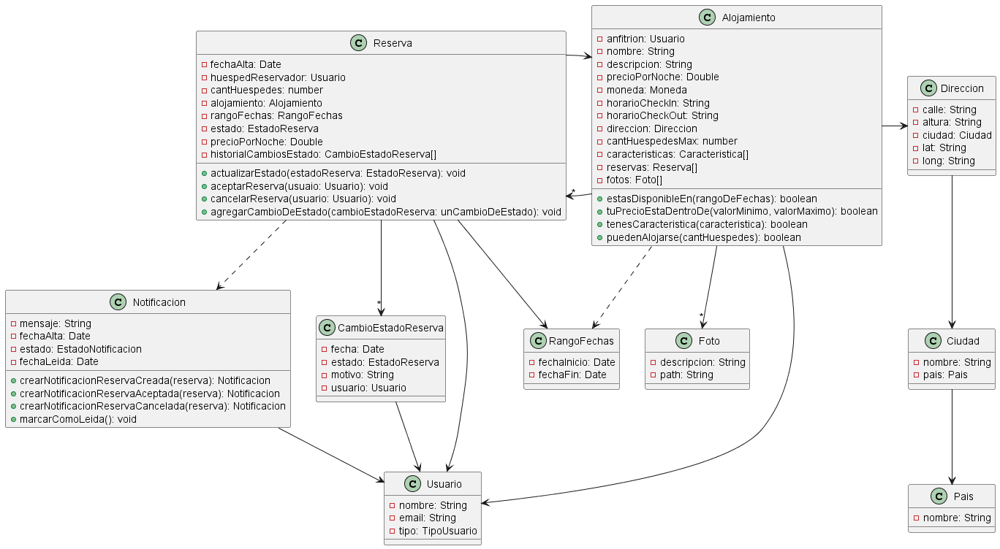

# Trabajo Práctico de Desarrollo de Software 2025 1C

## 👥 Integrantes 
- Rizzitano Lautaro
- Melchiori Lautaro
- Magnarelli Ulises

## 📜 [Enunciado](https://docs.google.com/document/d/1K0WJdOpcng4Jy-1PgIMz7CTtACT4HPSiiFB3IuM3l3o/edit?tab=t.0#heading=h.zho8hjgki4ue)

## 📐 Diagrama de Clases

## Despliegue

### Base de Datos

Para el despliegue de la base de datos se decidió utilizar la plataforma MongoDB Atlas, que es un servicio de bases de datos en la nube especialmente diseñado para bases de datos no relaciones con el motor MongoDB. Para desplegar la base de nuestro aplicativo allí por primera vez se creó un cluster y dentro de este las cuatro colecciones principales: usuarios, alojamientos, reservas y notificaciones. Una vez creadas, se migró el modelo de datos que teníamos de forma local a esta plataforma. Con la base de datos cargada solo resta obtener la connection string que permite a Mongoose conectarse al servicio en la nube, cosa que se realizará en el backend.

### Backend

El backend del aplicativo se decidió dockerizar para asegurar un despliegue cómodo y robusto. Para construir el contenedor se parte de la imagen oficial de NodeJS, y se especifica que deben correrse los comandos npm install para instalar todas las dependencias incluidas en el archivo package.json y luego npm start para iniciar el servidor backend, que ofrece una API REST para nuestro frontend. Es importante notar que el backend toma de las variables de entorno la connection string que le pasará a Mongoose para realizar la conexión a la base de datos; mientras que en el entorno de desarrollo se utiliza una conexión a una instancia local de MongoDB, para producción se debe proporcionar la connection string provista por MongoDB Atlas para que nuestro backend se conecte a esa instancia. Al desplegar en la plataforma Render, se especificó que lo que se estaba desplegando estaba dockerizado, por lo que se incluye en el repositorio del backend el Dockerfile y la plataforma sabe que debe buildear el contenedor desde allí. En esta misma plataforma, se detallan las variables de entorno a utilizar, particularmente la connection string de nuestra base de datos cloud. Es importante usar este método para acceder a las variables de entorno en lugar de incluir un archivo .env en nuestro repositorio, ya que eso haría accesible a todo el mundo nuestra clave de conexión a la base de datos. Una vez desplegado el backend, obtenemos la URL donde se ha desplegado, que será muy importante para quien quiera utilizar nuestro backend, en nuestro caso, el frontend.

### Frontend

Por último, se despliega el frontend. Como este ha sido desarrollado con React, es importante entender que si bien durante el desarrollo se utiliza un servidor frontend que permite cambiar el código y verlo ejecutarse en tiempo real, para el despliegue en producción lo que se hace es compilar todo ese código JSX a código HTML, CSS y Javascript puro. De esta forma, lo que nos queda es un sitio web estático que ofrece una vista al usuario y se comunica con nuestro backend para crear, obtener, actualizar y borrar información. Es por esto que el despliegue del frontend se hizo en la plataforma Netlify, que permite alojar sitios web estáticos. Para desplegar se sube nuestro código de react junto al script que permite compilarlo: npm run build. Esto genera una carpeta con todos los archivos estáticos que serviremos realmente. De forma análoga a la comunicación entre backend y base de datos, el frontend accede a la URL del backend al que debe comunicarse mediante una variable de entorno, por lo que es importante proveer en nuestro despliegue la URL donde desplegamos el backend anteriormente

### Paso a Paso

Es importante notar que se crearon repositorios especiales para el despliegue: uno para el backend y otro para el frontend. Estos repositorios contienen una versión testeada y apta para producción del código de nuestro aplicativo.

#### Base de datos
  - Abrir un cluster en MongoDB Atlas
  - Crear allí una base de datos con las colecciones: usuarios, alojamientos, notificaciones y reservas
  - Migrar los datos iniciales a esta base de datos
  - Guardar la connection string

#### Backend
  - Dockerizar el aplicativo: crear un Dockerfile que especifique la imagen base de node y los comandos a ejecutar (npm install && npm start)
  - Desplegar en Render este aplicativo especificando que esta dockerizado
  - Especificar como variable de entorno la connection string dada por Atlas
  - Guardar la URL del deploy

#### Frontend
  - Desplegar en Netlify el repositorio con nuestro código y especificar el comando de construcción de la versión para producción (npm run build)
  - Especificar como variable de entorno la URL del backend.

Para subir nuevas releases, basta con pushear a estos repositorios de deploy la versión
actualizada de nuestro código ya que ambas plataformas de deploy están configuradas para
trackear los commits sobra la rama principal del repositorio y re-deployear ante la aparición de
uno nuevo.